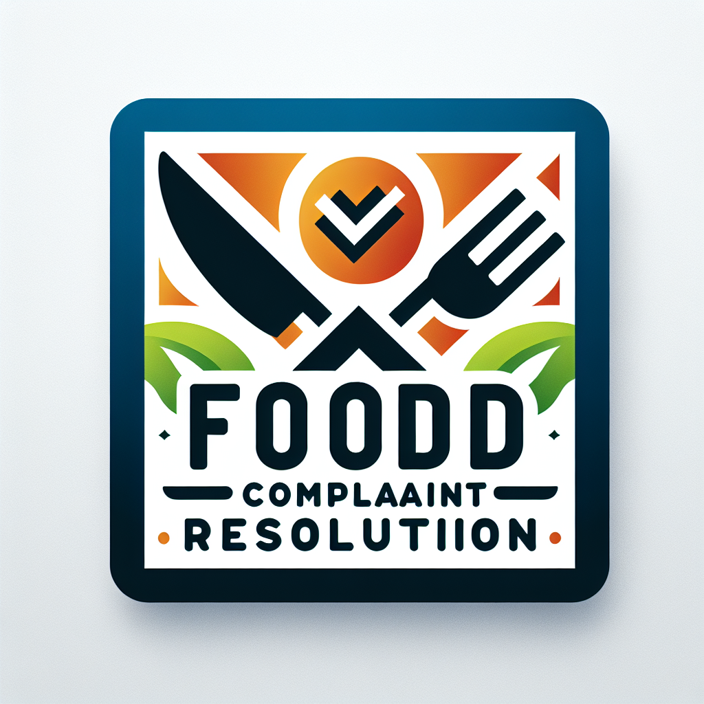

[](https://www.streamlit.io/)
[](https://www.clarifai.com/)
[](https://www.python.org/)

# Food Complaint Resolution
<p align="center">
  <a href="https://github.com/rsnagarkar10/Food-complaint-resolution-app"></a>
</p>


#

<p align="center">
  <strong>User Friendly AI-Driven Food Delivery Complaint System</strong>
</p>


<!--  -->
<p align="center">
  
</p>

Food-complaint-resolution application is an AI based customer complaint system with market specific to the food delivery companies. Although many food delivery companies have customer complaint system and which requires the involvement of human to handle the complaint for their customers.<br>
For example a customer ordered the pita bread and he received the pita bread expired and when he will do complain, after some time a human will check the complain, he will evaluate the compalint based on metadata like images of bread and compalint description. After that customer will be given the cash back if human see pit bread was delivery to customer was really expired. This is time consuming, may be human is not available at currently and takes the human effort. 

Using food complaint resolution application a food delivery company can reduce time and human effort to process the complaint. It will take  hardly take the few seconds to process the complaint of customer thus reducing the time and human effort involved. 

We developed with ❤️ using the latest AI models Food Item recognition, GPT-4 Turbo and GPT-4 vision to automate the customer complaint reducing. We have provided the user friendly interface using the streamlit library.<br>
This system processes the application just like a human evaluates the complaint based on metadata like complaint description and images. After evaluating the information provided by customer, our system gives the cash back based on company policies if customer is eligible for cash back. In case if customer is not satisfied with cash back / after max tries our system will redirect the customer's complaint to a human.

### Features
    - Using AI for receiving the complaint reducing the human effort and time
    - User can select the item, write description and upload images of food for complaint
    - Complain will only be processed when user will provide all the required inputs
    - Using the *Food Item Recognition* model to recognize the food items in the image
    - GPT4-Turbo is used to validating the selected category and image entered
    - GPT4-vision model analyzes the description
    - Cashback or discount provided based on company's rules and regulations
    - User friendly interface for complaint submission
    - A maximum try limit has been set
    - Once the limit gets exceeded, user'll have to refer to the restaurant's management
You can read more about the project and see a demo [here](/).

### Built with
* [Clarifai's streamlit module](https://github.com/clarifai/module-template) - a template for creating a UI module with Clarifai using streamlit 
* [Food Item Recognition](https://clarifai.com/clarifai/main/models/food-item-recognition) - AI model for recognizing a wide variety of food items in images
* [GPT-4 Turbo](https://clarifai.com/openai/chat-completion/models/gpt-4-turbo) - is an advanced language model (llm)
* [GPT-4 vision](https://clarifai.com/openai/chat-completion/models/gpt-4-vision) - extends GPT-4's capabilities that can understand and answer questions about images

## Installation

To install and run Food Complaint Resolution locally, follow these steps:

1. **Clone the Repository:**

    ```bash
    git clone https://github.com/rsnagarkar10/Food-complaint-resolution-app.git

    ```

2. **Install the packages:**

    ```bash
        pip install -r requirements.txt
    
    ```

3. **Run the Application**
<br>Make sure to update the .env_example with your CLARIFAI_PAT or provide PAT through UI on application
    ```bash
        streamlit run app.py
    
    ```

## Usage
Food-complaint-resolution uses the streamlit library to provide user ease to complain about the food he received. User can easily select the choice for which he wants to raise the complaint, write the complaint and upload the photos of food. When user will done with entering information our system automatically will use that information to process the user complaint. User can see his complaint is processing, stage and reply (%ag of cashback return to user or not) of complaint from our system. After max tries if user is not satisfied with the reply then our system will redirect the user to human. 

### Visuals

### Where to ask for help?
Open a discussion or stop by our [discord](https://discord.gg/n58UfpCX) server

## Contributing 

Contributions are what make the open-source community an amazing place to learn, inspire, and create. Any contributions you make are **greatly appreciated**.

To contribute to Food Complaint Resolution App, 

Clone this repo locally and commit your code on a separate branch.
If you're making core changes please write unit tests for your code, and check that everything works by running the following before opening a pull-request

or 

1. Fork the Project
2. Create your Feature Branch (`git checkout -b yourBranchName`)
3. Make changes and make sure everything is working fine
4. Commit your Changes (`git commit -m 'Add message here'`)
5. Push to the Branch (`git push origin yourBranchName`)
6. Open a Pull Request

## Team Members
This software is written by the mutual effort of diverse team members :
**Team Leader [Indar Kumar](https://www.linkedin.com/in/indarkarhana/)**,
[Inam ul Rehman](https://www.linkedin.com/in/inamulrehman/),
[Jaweria Batool](https://www.linkedin.com/in/jaweria-batool/),
[Ranjeet Nagarkar](https://www.linkedin.com/in/ranjeet-nagarkar-772060104/),
[Ayesha Mehmood](https://www.linkedin.com/in/ayesha-mehmood-9264a228b/) and
[Usman Ali](https://www.linkedin.com/in/usmaneali/).

Also, thanks to all [contributors](https://github.com/rsnagarkar10/Food-complaint-resolution-app/graphs/contributors) of the software.
